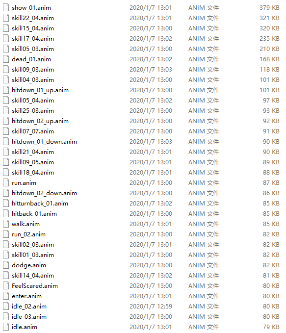
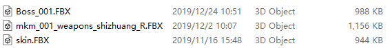
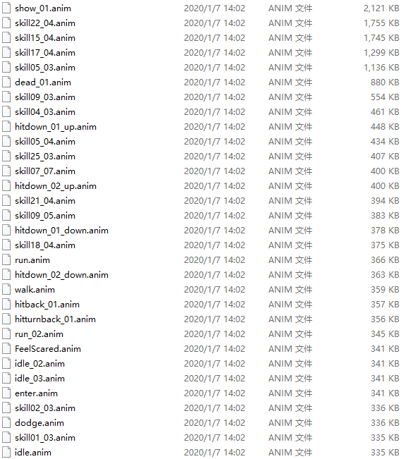
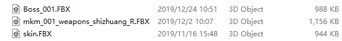
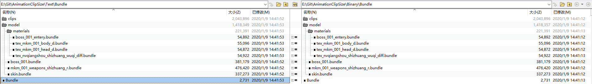
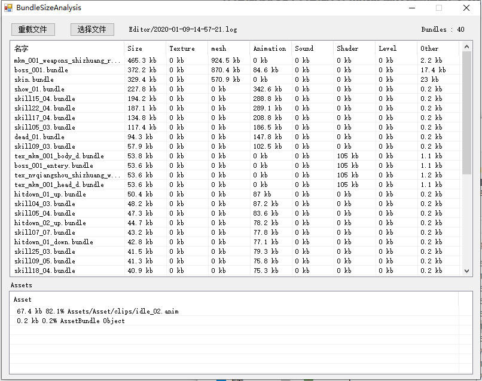
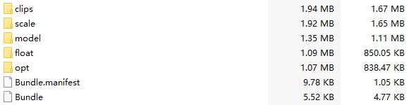
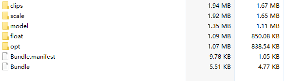

## 原始资源信息
### 二进制项目信息
#### clip资源信息

#### 模型资源信息

### 文本项目信息
#### clip资源信息

#### 模型资源信息

* 文件大小只有Unity创建的资源大小有区别。外包导入文件无变化

### Bundle比较
#### 文件比较

#### 资源大小分析

项目中的资源大小，对于bundle无影响。

## 优化资源信息
### binary 打包大小

### text 打包大小

## 结论
* 工程资源设置为二进制或者文本对于打包大小无影响。
* 浮点数精度对于动画片段的大小影响较大。

## 参考文章
[DY_M的Unity学习日记 1 ——AnimationClip的读取与代码生成](https://www.jianshu.com/p/80b2bc98ac5d)
[Unity动画文件优化探究](http://www.codershu.com/2017/06/14/UnityOptimizeAnimationClip/)